<div align="center">


# Hueco Mundo

**Areia branca sob a lua, céu morto e o vermelho dos Espadas.**

Um tema escuro para a web e para o VS Code, e o **Hollowzinho**:<br>
um Hollow de estimação em web component, que também mora no seu editor.

[](LICENSE)
[](#acessibilidade)
[](#instalar)

**[O que tem](#o-que-tem-aqui)** · **[Prints](#prints)** · **[Instalar](#instalar)** · **[Paleta](#paleta)** · **[Hollowzinho](#hollowzinho)** · **[VS Code](#vs-code)**

</div>

<br>

## O que tem aqui

São quatro peças **independentes**: use qualquer uma sozinha.

| | Onde | O que é |
|---|---|---|
| 🎨 **Tema para a web** | [`theme/`](theme) | Tokens `--hm-*`, componentes `hm-*` (botões, campos, abas, selos, progresso, avisos…) e as fontes. Só CSS. |
| 👾 **Hollowzinho** | [`pet/`](pet) | `<hollow-pet>`: um Hollow de estimação num web component, sem dependências e **sem nenhuma ligação com o tema**. Olha o cursor, aceita carinho, come, dorme, evolui e dispara um Cero. |
| 🧑‍💻 **Tema do VS Code** | [`vscode/theme`](vscode/theme) | 309 cores de interface, 29 regras de sintaxe, realce semântico e a paleta ANSI do terminal. |
| 🐾 **Hollowzinho no VS Code** | [`vscode/pet`](vscode/pet) | Extensão que põe o pet no Explorer e o liga ao editor: ele olha o seu cursor, se preocupa com erros, comemora testes, come commits e dispara um Cero que acende a linha em que você está. |

E a página de demonstração, [`index.html`](index.html), para ver tudo funcionando (e brincar com o pet).

## Prints

### O pet dentro do VS Code

Prints e gravação de um VS Code de verdade (1.117) com as duas extensões instaladas.

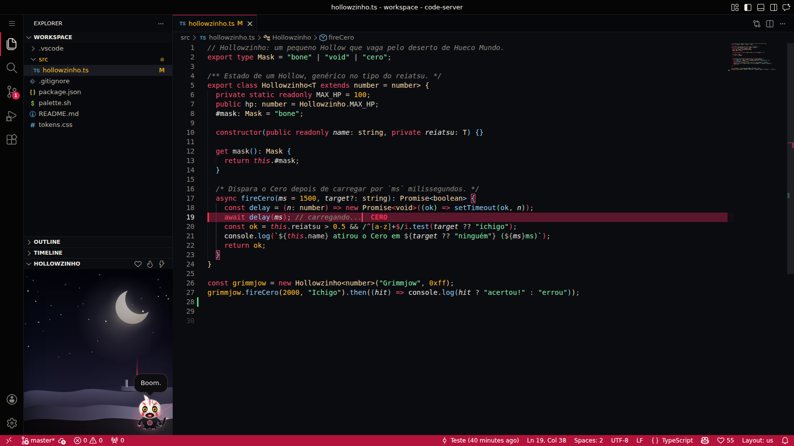

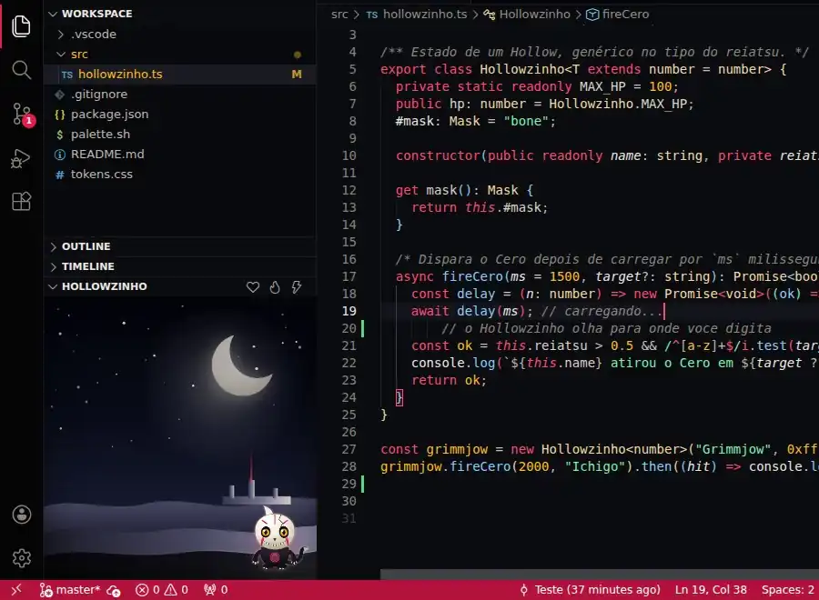

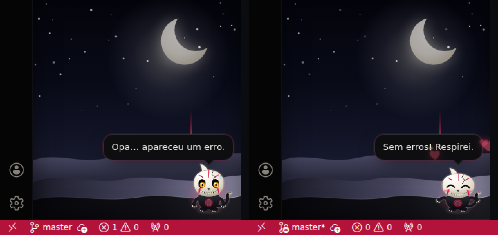

### Tema no VS Code

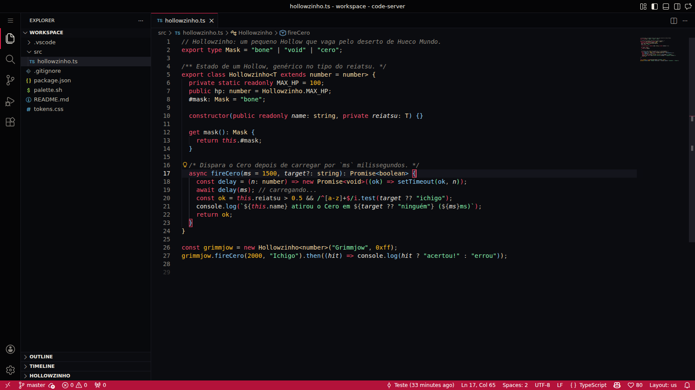

| CSS | Terminal |
|---|---|
| 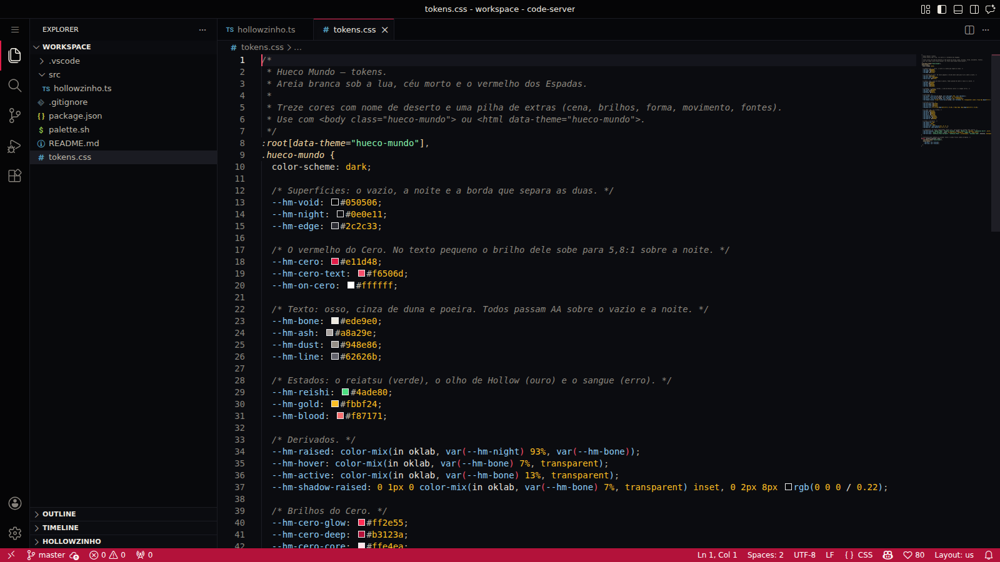 | 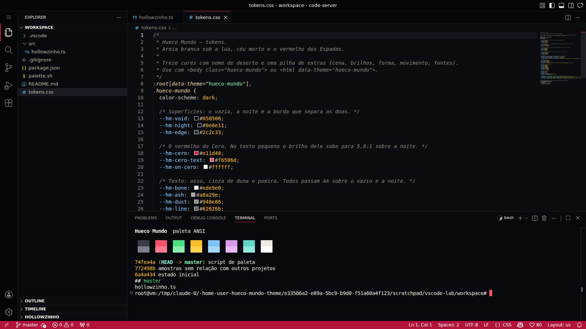 |

### Tema para a web

Os prints da página saem de um Chromium de verdade (`npm run shots`).


### Hollowzinho

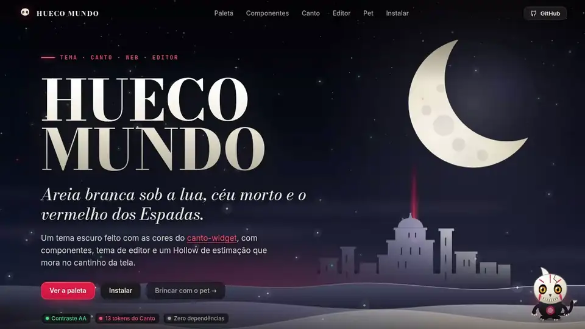


| Carinho | Bandeja | Dormindo |
|---|---|---|
|  |  |  |


<details>
<summary>Mais telas: mira, página de demonstração do pet, celular</summary>

<br>


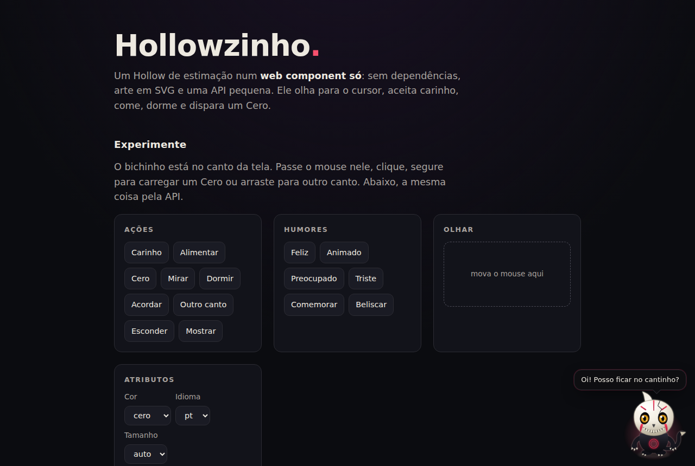

| Celular |
|---|
| 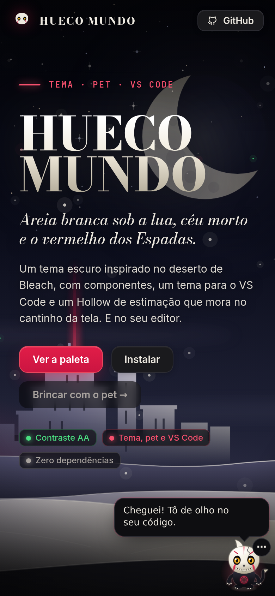 |

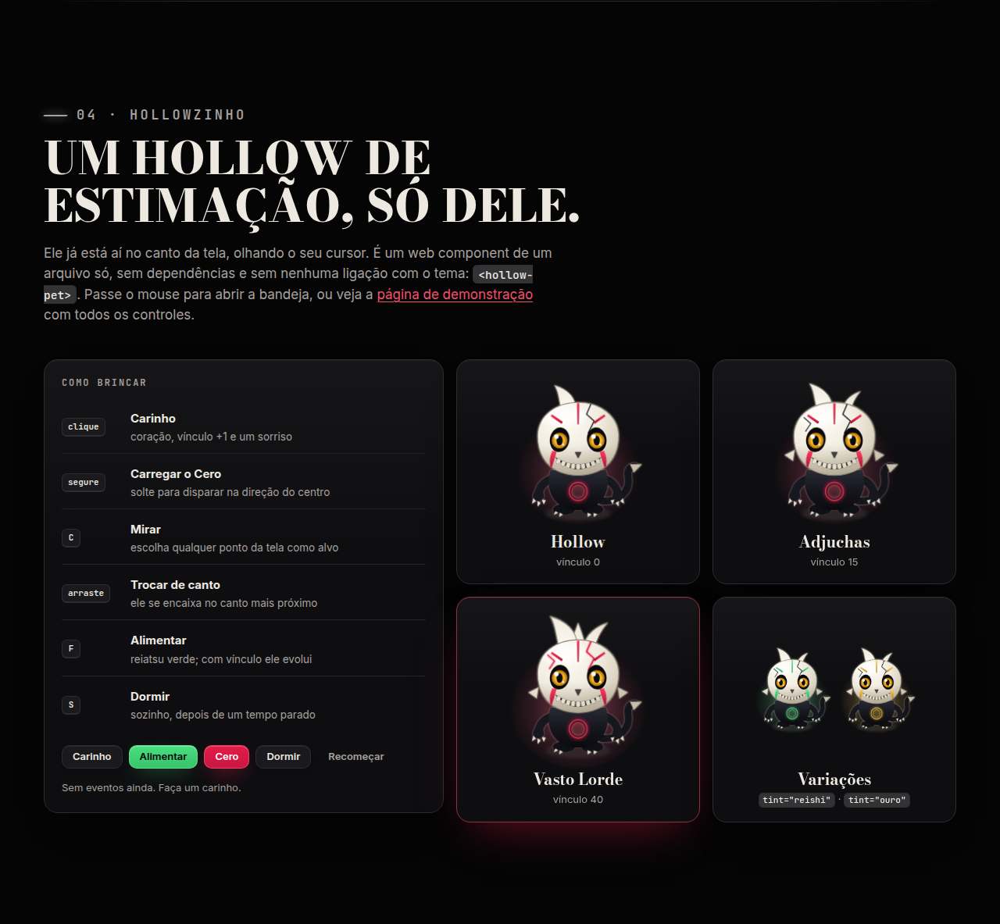

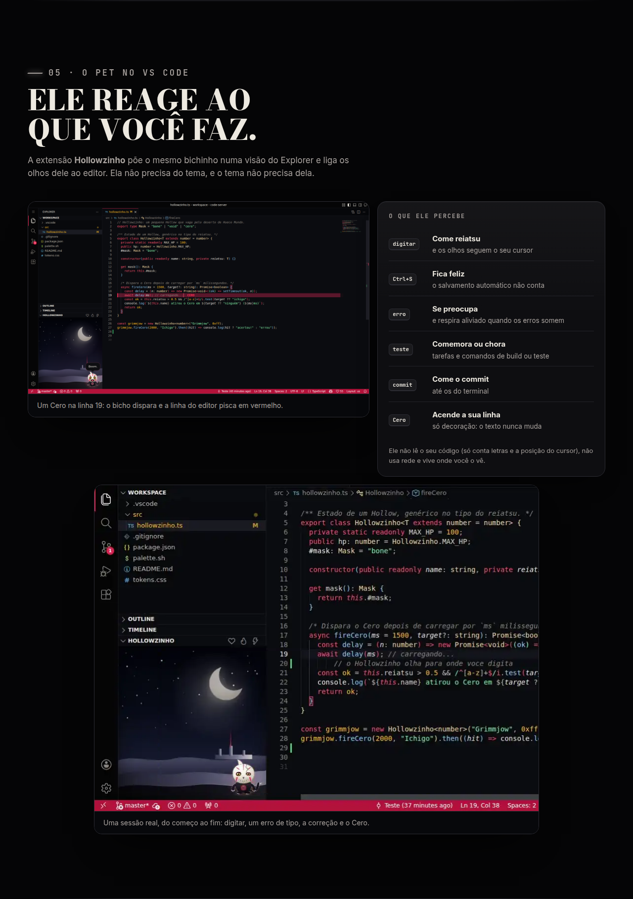

</details>

## Instalar

Nenhum passo de build.

**Tema em qualquer página**

```html
<link rel="stylesheet" href="theme/fonts.css">       <!-- opcional: Bodoni Moda, Inter e JetBrains Mono -->
<link rel="stylesheet" href="theme/hueco-mundo.css">

<body class="hueco-mundo">
```

Só os tokens: `<html data-theme="hueco-mundo">` com `theme/tokens.css`.

**Hollowzinho em qualquer página**

```html
<script src="pet/hollow-pet.js"></script>
<hollow-pet corner="br"></hollow-pet>
```

Ou, sem escrever HTML: `HollowPet.mount({ corner: "br" })`. A documentação completa (atributos, métodos, eventos, como guardar o estado) está em [`pet/README.md`](pet/README.md), e [`pet/demo.html`](pet/demo.html) mostra tudo funcionando.

**Tema no VS Code**

```sh
cd vscode/theme
npx @vscode/vsce package
code --install-extension hueco-mundo-0.1.0.vsix   # depois: Ctrl+K Ctrl+T e escolha Hueco Mundo
```

**Hollowzinho no VS Code**

```sh
cd vscode/pet
npx @vscode/vsce package
code --install-extension hollowzinho-0.1.0.vsix   # a visão "Hollowzinho" abre no Explorer
```

Os comandos, as 14 configurações e o que ele percebe estão em [`vscode/pet/README.md`](vscode/pet/README.md). Nenhuma das duas extensões está publicada no Marketplace.

**Tudo num arquivo**: `npm run bundle` gera `dist/hueco-mundo.html` (CSS, JS, fontes e prints embutidos).

## Paleta

| Token | Cor | Uso | Contraste |
|---|---|---|---|
| `--hm-void` | `#050506` | fundo de campos e da página | osso 16,8:1 |
| `--hm-night` | `#0e0e11` | painéis e cartões | osso 15,9:1 |
| `--hm-edge` | `#2c2c33` | divisores | decorativa |
| `--hm-bone` | `#ede9e0` | texto principal | 15,9:1 |
| `--hm-ash` | `#a8a29e` | texto secundário | 7,6:1 |
| `--hm-dust` | `#948e86` | dicas e placeholders | 5,9:1 |
| `--hm-line` | `#62626b` | bordas de controles | 3,2:1 (UI) |
| `--hm-cero` | `#e11d48` | ação e foco, o vermelho do Cero | branco sobre ele 4,7:1 |
| `--hm-cero-text` | `#f6506d` | texto em vermelho | 5,8:1 |
| `--hm-on-cero` | `#ffffff` | texto sobre o vermelho | |
| `--hm-reishi` | `#4ade80` | sucesso, o reiatsu | 11,1:1 |
| `--hm-gold` | `#fbbf24` | aviso, o olho de Hollow | 11,6:1 |
| `--hm-blood` | `#f87171` | erro | 7,0:1 |

Os contrastes são sobre `--hm-night`. Além deles há derivados, brilhos do Cero, a cena (lua, céu e areia), raios, curvas e fontes: tudo em [`theme/tokens.css`](theme/tokens.css).

## Componentes

[`theme/hueco-mundo.css`](theme/hueco-mundo.css) traz: `hm-btn` (`--primary`, `--ghost`, `--danger`, `--ok`, `--sm`, `--icon`), `hm-input`, `hm-select`, `hm-check`, `hm-box`, `hm-switch`, `hm-tabs`/`hm-tab`, `hm-chip`, `hm-progress`, `hm-alert`, `hm-kbd`, `hm-card`, `hm-surface`, `hm-eyebrow`, `hm-slash`, `hm-skeleton`. Foco com anel vermelho, alvos de 24 px ou mais, `prefers-reduced-motion`, `prefers-contrast` e `forced-colors` respeitados.

## Hollowzinho

Um Hollow chibi, desenhado do zero (SVG), que vive no canto da tela e **não atrapalha**: só o corpo, a bandeja e o balão recebem cliques.

| Gesto | O que faz |
|---|---|
| passar o mouse | os olhos seguem o cursor; abre a bandeja (reiatsu, vínculo e cinco ações) |
| **clique** | carinho: corações, vínculo +1 |
| **segurar** e soltar | carrega e dispara um Cero em direção ao centro da tela |
| tecla **C** ou botão ⚡ | mira: escolha qualquer ponto da tela como alvo |
| **arrastar** | levanta o bichinho; ao soltar ele se encaixa no canto mais próximo |
| tecla **F** ou botão | alimenta com reiatsu (+26) |
| tecla **S** ou botão | dorme; também dorme sozinho depois de um tempo parado |
| botão 👁 | esconde; um botão pequeno no canto chama de volta |

O **reiatsu** (verde) cai devagar e o Hollowzinho avisa quando está com fome; o **vínculo** (vermelho) sobe com carinho, comida e Cero. Com 15 de vínculo ele vira **Adjuchas** e com 40, **Vasto Lorde** (mais chifres, rachaduras brilhantes e aura).

Para quem integra: `look(x, y)`, `mood(humor, texto)`, `celebrate()` e `nibble(n)` ligam o bichinho ao que acontece na sua aplicação; `getState()`/`restore()` e o evento `hollow-pet:state` deixam **você** guardar o estado onde quiser (é o que a extensão do VS Code faz). Em janelas baixas o balão e a bandeja passam para o lado dele.

## VS Code

**Tema.** `vscode/theme`: palavras-chave em vermelho `#f6506d`, textos em verde `#86efac`, números em ouro `#fbbf24`, funções em azul de lua `#8ecdf5`, tipos em pergaminho `#f3d9a4`. Todas as cores de sintaxe passam AA sobre `#0b0c10`.

**Pet.** `vscode/pet`: o mesmo `<hollow-pet>` dentro de um webview, mais um pouco de cola:

| Você faz | Ele faz |
|---|---|
| digita | come reiatsu e os olhos seguem o cursor |
| salva com `Ctrl+S` | fica feliz |
| aparece um erro | se preocupa; respira quando some |
| uma tarefa ou um comando de build/teste termina | comemora com um Cero para cima, ou fica chateado |
| faz um commit (inclusive no terminal) | come o commit |
| `Hollowzinho: Cero at the current line` | dispara, e a sua linha pisca em vermelho (só decoração: o texto nunca muda) |

Ele não lê o seu código (só conta letras e a posição do cursor), não usa rede, guarda o estado no armazenamento global do VS Code e só reage enquanto a visão está aberta. Foi testado num VS Code 1.117 de verdade (via code-server): digitar, olhar, salvar, erros, tarefas, terminal, commit, comandos, configurações ao vivo e persistência. Não foi testado no desktop do Windows nem do macOS.

## Acessibilidade

- Contraste WCAG AA em 58 pares verificados: o tema da web (texto e UI), a sintaxe do editor, as abas, a barra de status, as 15 cores ANSI e os chips de erro e aviso: `npm run contrast`.
- A página de demonstração e a do pet (`pet/demo.html`) passam no **axe-core** (WCAG 2.2 AA e boas práticas) em desktop e celular, sem violações.
- O pet é operável só pelo teclado (Tab, Enter/Espaço, F, C, S, Esc), tem nome acessível, balão com `aria-live` e medidores com `role="meter"`; ilustrações embutidas e estáticas ficam `aria-hidden`.
- `prefers-reduced-motion`: sem passeios, pulos nem tremor; o Cero vira um clarão curto (e, no VS Code, um único clarão na linha).

## Desenvolvimento

```sh
npm install        # só o Playwright, para os scripts (na primeira vez: npx playwright install chromium)
npm run serve      # a página em http://127.0.0.1:8080
npm test           # cópia do pet na extensão + contraste + 53 verificações do pet num navegador de verdade
npm run sync       # copia pet/hollow-pet.js para vscode/pet/media (e a licença para as extensões)
npm run shots      # refaz docs/shots/
npm run demo       # regrava docs/shots/pet-demo.webp (precisa do ffmpeg)
npm run bundle     # dist/hueco-mundo.html, um arquivo só
```

```
theme/      tokens.css, hueco-mundo.css, fonts.css, fonts/
pet/        hollow-pet.js (+ .d.ts), README, demo.html, lab.html (estados)
vscode/
  theme/    extensão com o tema de cores
  pet/      extensão do Hollowzinho (extension.js + media/)
site/       CSS e JS da página de demonstração
scripts/    contrast, pet-smoke, sync-vscode, shots, demo, bundle, pet-icon, serve
docs/shots/ os prints da página
index.html  a página de demonstração (serve para o GitHub Pages direto da raiz)
```

Os prints do VS Code ficam junto de cada extensão (`vscode/*/docs`); foram feitos com o code-server, que roda o VS Code de verdade num navegador.

## Créditos e licença

Inspirado em *Bleach* (© Tite Kubo / Shueisha). Projeto de fã, sem afiliação. O Hollowzinho e toda a arte são originais. As fontes (Bodoni Moda, Inter, JetBrains Mono) estão sob a SIL OFL 1.1, veja [`theme/fonts/LICENSES.md`](theme/fonts/LICENSES.md). Código sob [MIT](LICENSE).
