<div align="center">

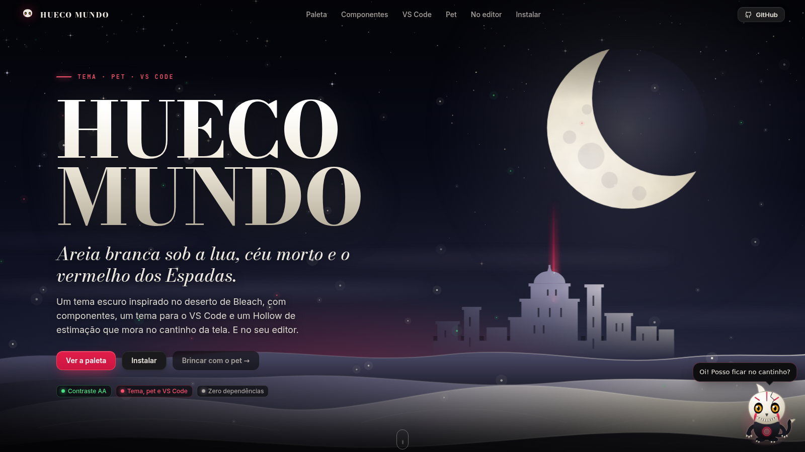

# Hueco Mundo

**Areia branca sob a lua, céu morto e o vermelho dos Espadas.**

Um tema escuro para o [Canto](https://github.com/juninmd/canto-widget), para a web e para o editor,<br>
feito com as cores do canto-widget e com um Hollow de estimação que mora no cantinho da tela.

[](LICENSE)
[](#acessibilidade)
[](#instalar)

**[Paleta](#paleta)** · **[Componentes](#componentes)** · **[Canto](#no-canto)** · **[Hollowzinho](#hollowzinho)** · **[VS Code](#vs-code)** · **[Instalar](#instalar)**

</div>

<br>

## O que tem aqui

| | |
|---|---|
| 🎨 **Tokens** | Os 13 tokens do Canto (`--color-ink`, `--color-panel`, `--color-accent`…) com os mesmos nomes. O bloco substitui a skin `hueco-mundo` de lá sem mexer em mais nada. |
| 🧱 **Componentes** | Classes `hm-*`: botões, campos, abas, selos, progresso, avisos, atalhos. Mesmo desenho do Canto, com o halo do Cero. |
| 👾 **Hollowzinho** | `<hollow-pet>`, um web component sem dependências: um Hollow de estimação no cantinho da tela. Olha o cursor, aceita carinho, come reiatsu, dispara Cero, dorme e evolui. |
| 🪟 **Extras do Canto** | `canto-extras.css`, opcional: lua no canto da janela, brilho na aba ativa, nos botões e nas barras. |
| 🧑‍💻 **VS Code** | Tema de editor e de terminal com a mesma paleta. |
| 🖼️ **Página de demonstração** | `index.html`, para ver tudo funcionando (e brincar com o pet). |

## Prints

Os prints da página saem de um Chromium de verdade (`npm run shots`).

### Paleta

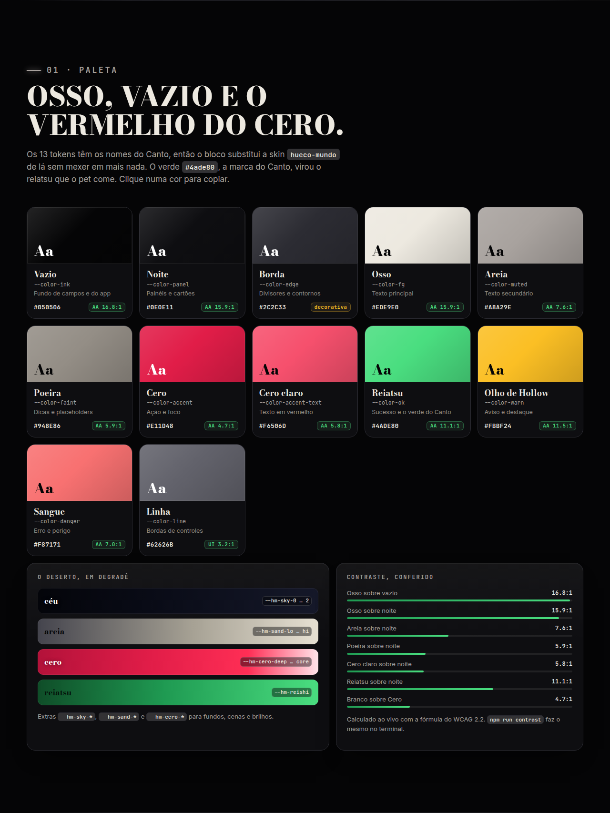

As cores partem das skins do Canto: o painel quase preto, o texto cor de osso e o vermelho `#e11d48`. O verde `#4ade80`, a marca do Canto, virou o **reiatsu** que o pet come; o ouro `#fbbf24` é o olho de Hollow.

### Componentes

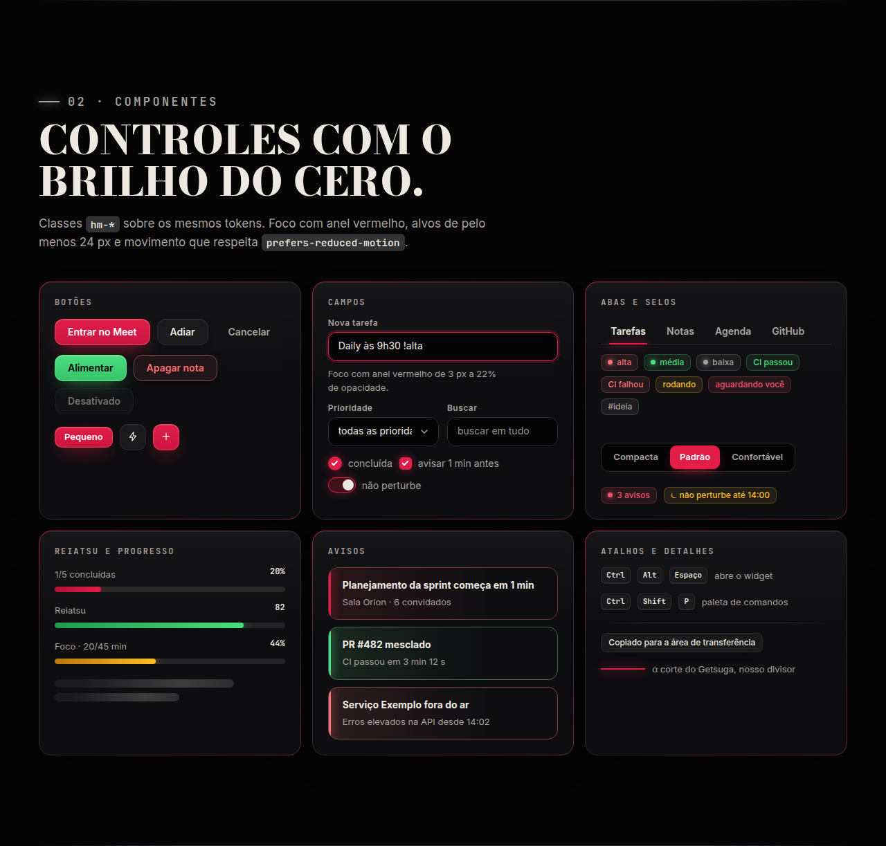

### Canto, o app de verdade

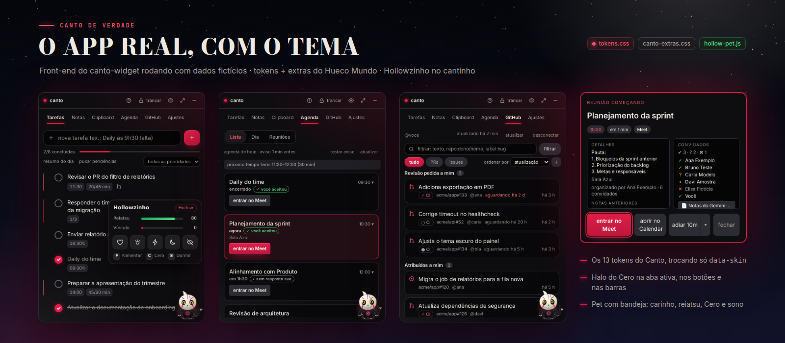

O front-end do canto-widget rodando com dados fictícios (o IPC do Tauri é simulado, como no e2e dele). Os prints usam a fonte Inter no lugar da Segoe UI, só porque o ambiente é Linux.

### Editor e terminal

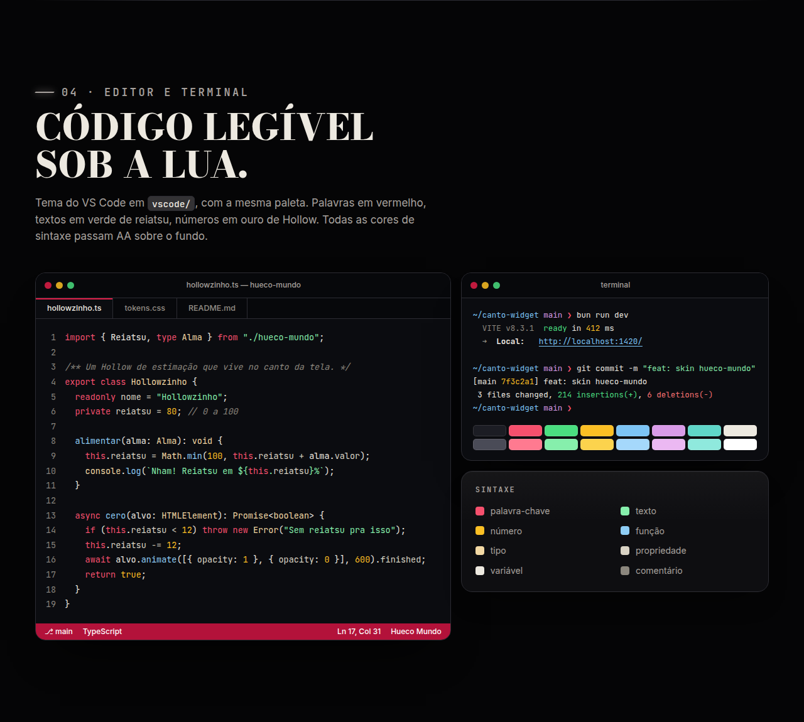

### Hollowzinho

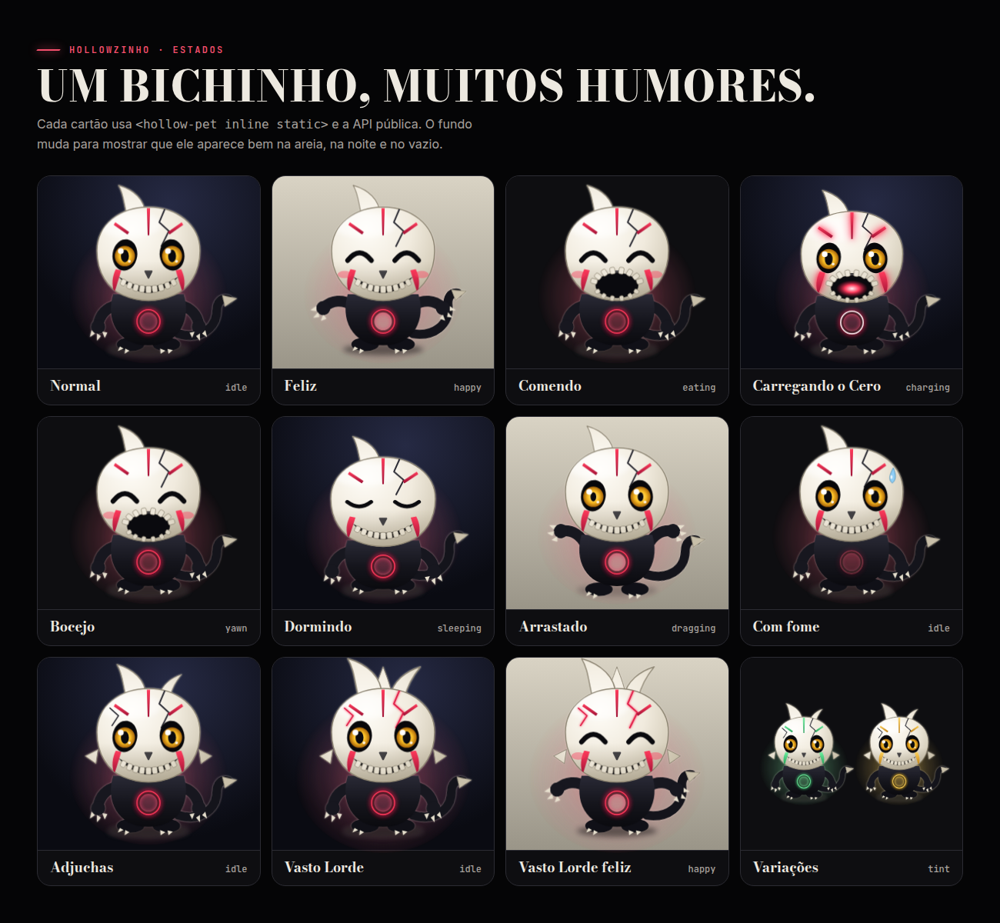

| Carinho | Bandeja | Dormindo |
|---|---|---|
| 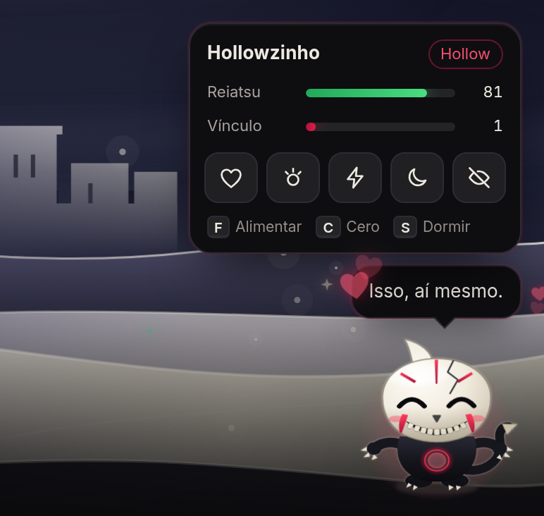 | 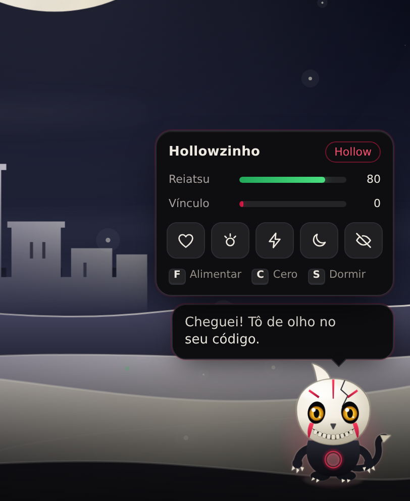 | 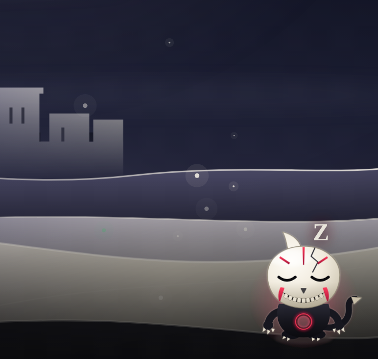 |

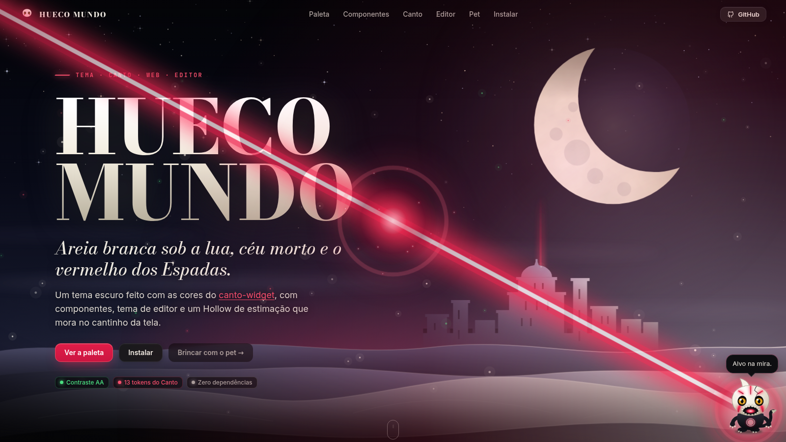

<details>
<summary>Mais telas: mira, celular, componentes em detalhe</summary>

<br>

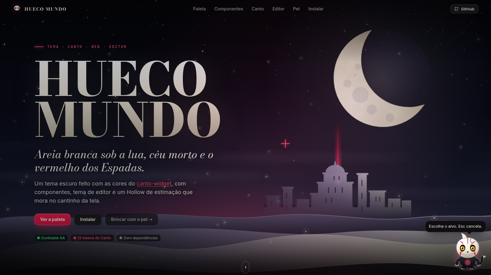

| Celular |
|---|
| 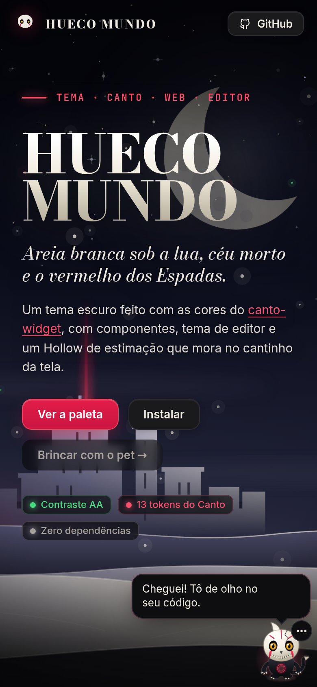 |

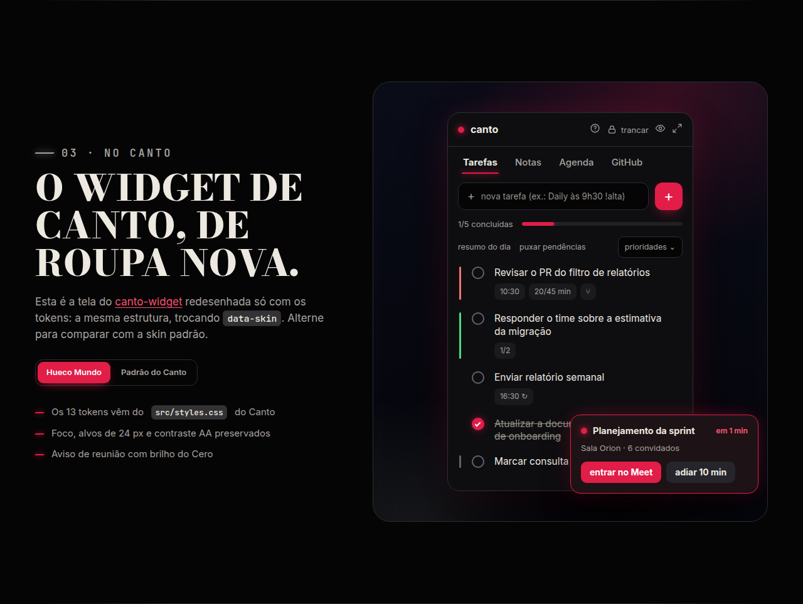

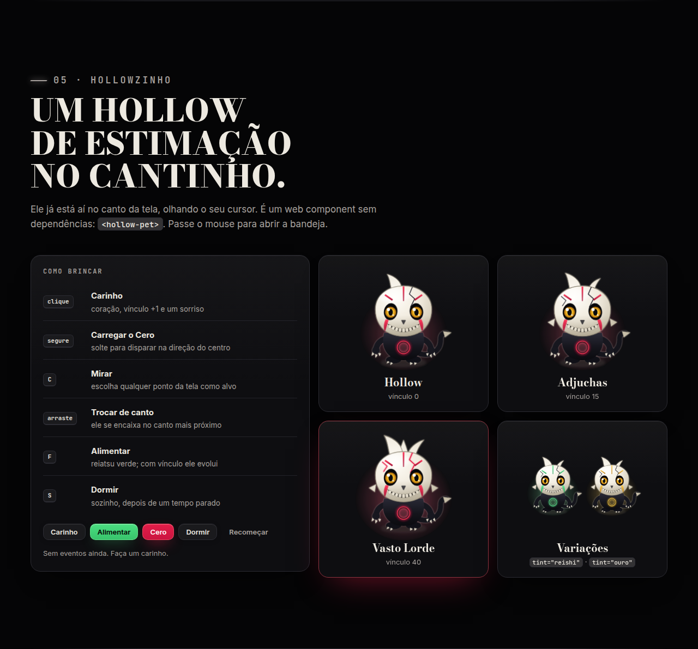

</details>

## Instalar

Nenhum passo de build. Copie `src/` para onde quiser.

**Em qualquer página**

```html
<link rel="stylesheet" href="src/fonts.css">       <!-- opcional: Bodoni Moda, Inter e JetBrains Mono -->
<link rel="stylesheet" href="src/hueco-mundo.css">

<body class="hueco-mundo">
```

Só os tokens, do jeito do Canto: `<html data-skin="hueco-mundo">` com `src/tokens.css`.

**O pet no cantinho**

```html
<script src="src/hollow-pet.js"></script>
<hollow-pet corner="br"></hollow-pet>
```

Ou, sem escrever HTML: `HollowPet.mount({ corner: "br" })`.

**No Canto** (`src/styles.css` do canto-widget)

```css
/* troque o bloco :root[data-skin="hueco-mundo"] pelo conteúdo de src/tokens.css */
@import "hueco-mundo-theme/src/canto-extras.css"; /* opcional */
```

```ts
// main.tsx
import "hueco-mundo-theme/pet";
window.HollowPet.mount({ corner: "br" });
```

A skin continua escolhida em **Ajustes → Aparência** (`canto.skin = "hueco-mundo"`).

**VS Code**

```sh
cp -r vscode ~/.vscode/extensions/hueco-mundo   # reinicie e escolha Hueco Mundo em Temas de Cores
```

> O tema do VS Code foi validado (JSON, contraste e `vsce package`). Ainda não o abri num editor de verdade; se algo ficar estranho, abra uma issue.

**Tudo num arquivo**: `npm run bundle` gera `dist/hueco-mundo.html` (CSS, JS e fontes embutidos, ~350 KB).

## Paleta

| Token | Cor | Uso | Contraste |
|---|---|---|---|
| `--color-ink` | `#050506` | fundo de campos e do app | texto osso 16,8:1 |
| `--color-panel` | `#0e0e11` | painéis e cartões | texto osso 15,9:1 |
| `--color-edge` | `#2c2c33` | divisores | decorativa |
| `--color-fg` | `#ede9e0` | texto principal | 15,9:1 |
| `--color-muted` | `#a8a29e` | texto secundário | 7,6:1 |
| `--color-faint` | `#948e86` | dicas e placeholders | 5,9:1 |
| `--color-line` | `#62626b` | bordas de controles | 3,2:1 (UI) |
| `--color-accent` | `#e11d48` | ação e foco, o vermelho do Cero | branco sobre ele 4,7:1 |
| `--color-accent-text` | `#f6506d` | texto em vermelho | 5,8:1 |
| `--color-on-accent` | `#ffffff` | texto sobre o accent | |
| `--color-ok` | `#4ade80` | sucesso, o reiatsu | 11,1:1 |
| `--color-warn` | `#fbbf24` | aviso, o olho de Hollow | 11,5:1 |
| `--color-danger` | `#f87171` | erro | 7,0:1 |

Os contrastes são sobre `--color-panel`. Os extras `--hm-*` (céu, areia, Cero, fontes, raios e curvas) estão em [`src/tokens.css`](src/tokens.css). Em relação à skin atual do Canto, a única cor que mudou foi `--color-ok` (`#86efac` → `#4ade80`, o verde da marca).

## Componentes

`src/hueco-mundo.css` traz: `hm-btn` (`--primary`, `--ghost`, `--danger`, `--ok`, `--sm`, `--icon`), `hm-input`, `hm-select`, `hm-check`, `hm-box`, `hm-switch`, `hm-tabs`/`hm-tab`, `hm-chip`, `hm-progress`, `hm-alert`, `hm-kbd`, `hm-card`, `hm-surface`, `hm-eyebrow`, `hm-slash`, `hm-skeleton`. Foco com anel vermelho, alvos de 24 px ou mais, `prefers-reduced-motion`, `prefers-contrast` e `forced-colors` respeitados.

## No Canto

O tema usa só os tokens do Canto, então vale para qualquer tela dele. O `canto-extras.css` acrescenta o brilho usando seletores que o Canto já tem (`#root > div`, `[role="tab"][aria-selected]`, `button.bg-accent`, `.canto-field`, `.canto-check`), todos escopados por `data-skin="hueco-mundo"`.

## Hollowzinho

Um Hollow chibi, desenhado do zero (SVG), que vive no canto da tela e **não atrapalha**: só o corpo, a bandeja e o balão recebem cliques.

| Gesto | O que faz |
|---|---|
| passar o mouse | os olhos seguem o cursor; abre a bandeja (reiatsu, vínculo e cinco ações) |
| **clique** | carinho: corações, vínculo +1 |
| **segurar** e soltar | carrega e dispara um Cero em direção ao centro da tela |
| tecla **C** ou botão ⚡ | mira: escolha qualquer ponto da tela como alvo |
| **arrastar** | levanta o bichinho; ao soltar ele se encaixa no canto mais próximo e vira para dentro da tela |
| tecla **F** ou botão | alimenta com reiatsu (+26) |
| tecla **S** ou botão | dorme; também dorme sozinho depois de um tempo parado |
| botão 👁 | esconde; um botão pequeno no canto chama de volta |

O **reiatsu** (verde) cai devagar e o Hollowzinho avisa quando está com fome; o **vínculo** (vermelho) sobe com carinho, comida e Cero. Com 15 de vínculo ele vira **Adjuchas** e com 40, **Vasto Lorde** (mais chifres, rachaduras brilhantes e aura). O estado fica no `localStorage` (`hueco-mundo:pet`), com o reiatsu caindo um pouco enquanto você está fora.

**Atributos**: `corner` (`br`, `bl`, `tr`, `tl`), `size` (px), `name`, `lang` (`pt`, `en`), `tint` (`reishi`, `ouro`), `inline` (não fixa na tela), `static` (sem vida própria), `no-persist`, `shake` (seletor da página que treme no Cero).<br>
**Métodos**: `pet()` `feed()` `cero({x,y,power})` `aim()` `sleep()` `wake()` `say(texto)` `dock(canto)` `reset()` `setStage(n)` `setStats({reiatsu,bond})`.<br>
**Eventos**: `hollow-pet:pet`, `feed`, `cero`, `sleep`, `wake`, `levelup` (com `detail: { stage, bond, reiatsu }`).<br>
**Cores do host**: a bandeja e o balão herdam `--color-panel`, `--color-fg`, `--color-accent`… da página, com a paleta do tema como reserva.

Tipos em [`src/hollow-pet.d.ts`](src/hollow-pet.d.ts). Para React/TSX:

```ts
import type { HollowPetElement } from "hueco-mundo-theme/pet";
declare module "react" {
  namespace JSX {
    interface IntrinsicElements {
      "hollow-pet": React.DetailedHTMLProps<React.HTMLAttributes<HollowPetElement>, HollowPetElement> & { corner?: string; size?: number; tint?: string };
    }
  }
}
```

## VS Code

`vscode/themes/hueco-mundo-color-theme.json`: 219 cores de interface, 29 regras de sintaxe, tokens semânticos e a paleta ANSI do terminal. Palavras-chave em vermelho, textos em verde, números em ouro, funções em azul de lua, tipos em pergaminho. Todas as cores de sintaxe passam AA sobre `#0b0c10`.

## Acessibilidade

- Contraste WCAG AA em 40 pares verificados, 20 do tema (texto e UI) e 20 do editor (sintaxe, abas, barra de status): `npm run contrast`.
- A página de demonstração passa no **axe-core** (WCAG 2.2 AA e boas práticas) em desktop e celular, sem violações.
- O pet é operável só pelo teclado (Tab, Enter/Espaço, F, C, S, Esc), tem nome acessível, balão com `aria-live` e medidores com `role="meter"`; ilustrações embutidas e estáticas ficam `aria-hidden`.
- `prefers-reduced-motion`: sem passeios, pulos nem tremor; o Cero vira um clarão curto.

## Desenvolvimento

```sh
npm install        # só o Playwright, para os scripts (na primeira vez: npx playwright install chromium)
npm run serve      # a página em http://127.0.0.1:8080
npm test           # contraste + 34 verificações do pet num navegador de verdade
npm run shots      # refaz docs/shots/
npm run bundle     # dist/hueco-mundo.html, um arquivo só
```

```
src/        tokens.css, hueco-mundo.css, canto-extras.css, fonts.css, hollow-pet.js (+ .d.ts), fonts/
vscode/     extensão com o tema de cores
site/       CSS e JS da página, pet-lab.html (estados) e board.html (prancha do Canto)
scripts/    contrast, pet-smoke, shots, bundle, serve
docs/shots/ os prints
index.html  a página de demonstração (serve para o GitHub Pages direto da raiz)
```

Os prints do Canto real (`docs/shots/canto/`) foram feitos rodando o front-end do canto-widget com o IPC simulado e dados fictícios; esse script não está aqui.

## Créditos e licença

Inspirado em *Bleach* (© Tite Kubo / Shueisha). Projeto de fã, sem afiliação. O Hollowzinho e toda a arte são originais. As fontes (Bodoni Moda, Inter, JetBrains Mono) estão sob a SIL OFL 1.1, veja [`src/fonts/LICENSES.md`](src/fonts/LICENSES.md). Código sob [MIT](LICENSE).
