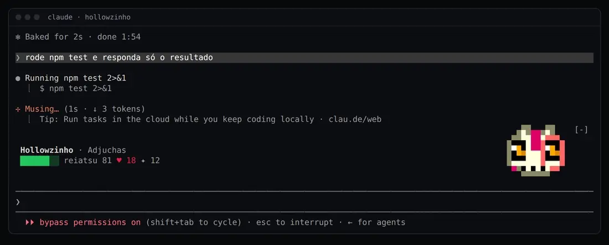
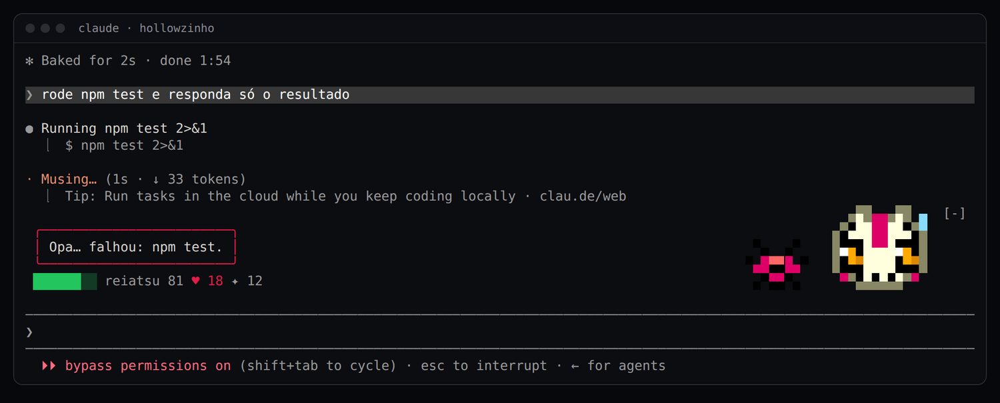
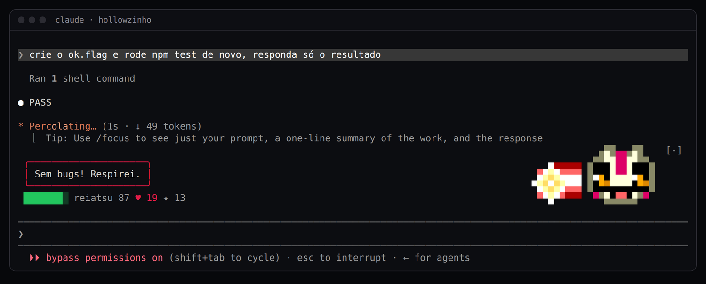
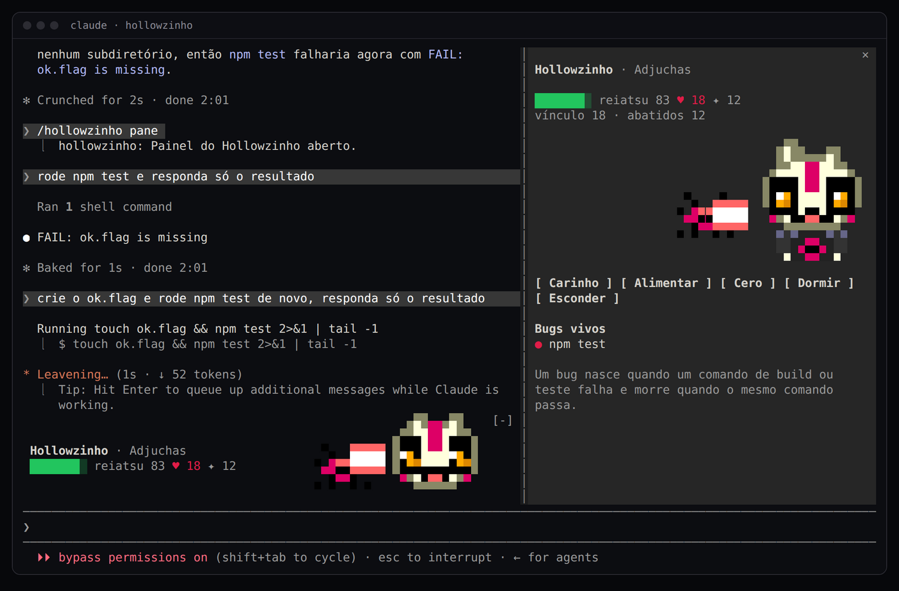
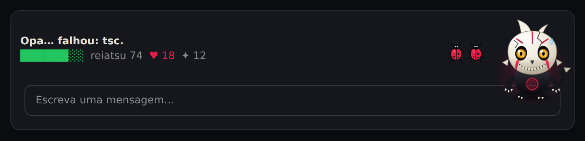
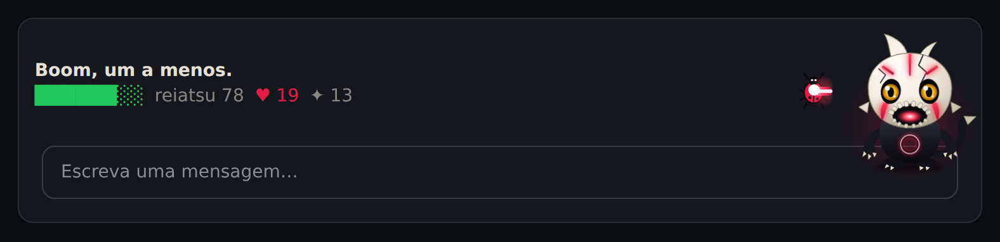
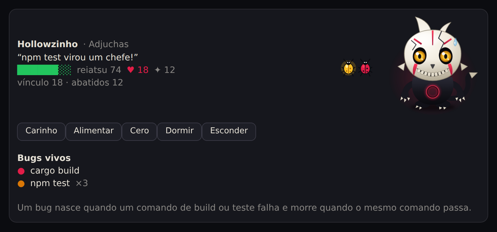

# Hollowzinho para o Claude Code

Um Hollow de estimação que mora no seu Claude Code. Ele **reage ao que o Claude faz**: cada build ou teste que falha vira um **bug**, e quando o mesmo comando passa ele **abate o bug com um Cero**. Também come os seus prompts e commits, caça enquanto o Claude trabalha e dorme quando você some.



Os prints deste README são do **Claude Code de verdade** (v2.1.289, num terminal de 120 colunas), com o plugin instalado: nada aqui é maquete. Só os do desktop são prévias, e dizem isso.

É o mesmo bichinho do [`<hollow-pet>`](../../pet) e da [extensão do VS Code](../../vscode/pet), agora em pixel art de terminal. Não precisa de mais nada: não usa rede, não escreve arquivos e não chama modelo.

## Instalar

No Claude Code:

```
/plugin marketplace add juninmd/hueco-mundo-theme
/plugin install hollowzinho@hueco-mundo
```

Ou, do terminal: `claude plugin marketplace add juninmd/hueco-mundo-theme && claude plugin install hollowzinho@hueco-mundo`.

Para experimentar sem instalar, aponte para a pasta (num clone deste repositório):

```sh
claude --plugin-dir ./claude-code/hollowzinho
```

A faixa aparece acima do prompt assim que a sessão abre. Na instalação o Claude Code avisa que **6 opções ainda não foram definidas**; pode ignorar, os padrões servem. Para mudar alguma: `/plugin configure hollowzinho@hueco-mundo`.

Precisa de um Claude Code com plugins de *function hooks* (módulos em `hooks/hooks.json`). Foi testado na **2.1.289**.

## O que ele percebe

| O que acontece | O que ele faz |
| --- | --- |
| um comando de **build ou teste falha** (`npm test`, `cargo build`, `pytest`, `tsc`, `make`…) | nasce um **bug** ao lado dele: *"Opa… falhou: npm test."* |
| o **mesmo comando falha de novo** | o bug conta mais uma falha (×2, ×3…) e, na **terceira**, vira um **chefe dourado** |
| o mesmo comando **passa** | atira o **Cero** e abate o bug (o chefe vale dois): *"Sem bugs! Respirei."* |
| o Claude roda `npm test 2>&1 \| tail` | o `tail` esconde o código de saída, então ele **lê o final da saída**: `FAIL`, `1 failed`, `error TS…`, `Traceback`… |
| você **manda um prompt** | come um pouco do texto e acorda |
| o Claude **trabalha** (turno em andamento) | modo caçador: a marca vermelha no rosto |
| o turno **acaba com bugs vivos** | fica preocupado e diz quantos faltam |
| você **interrompe** o turno | leva um susto |
| **commit**, **push**, **PR** criado ou mergeado, **branch nova** | come, comemora, cria vínculo |
| o Claude **edita arquivos** | come um pouco, de vez em quando comenta |
| nada acontece por **5 minutos** | dorme (e acorda no próximo prompt) |

O **reiatsu** (barra verde) cai devagar e o bichinho avisa quando está com fome; o **vínculo** (♥ vermelho) cresce com comida, carinho, commits e bugs abatidos (✦). Com 15 de vínculo ele vira **Adjuchas** e com 40, **Vasto Lorde**.



**Um bug é um comando, não uma linha.** `npm test`, `npm test -- a.test.ts` e `npm test --watch=false` são o mesmo bug. Só o que parece build, teste ou verificação conta: um `grep` sem resultado também sai com erro e **não** é problema. Ele não corrige nada: quem faz o teste passar é o Claude (ou você).



## O comando `/hollowzinho`

```
/hollowzinho [pet | feed | cero | sleep | wake | hide | show | status | reset | pane]
```

| Subcomando | Faz |
| --- | --- |
| `pane` | abre o **painel** do bicho (veja abaixo) |
| `pet` | carinho |
| `feed` | dá reiatsu (+26) |
| `cero` | atira no bug mais perto. Custa 12 de reiatsu e **só raspa**: quem abate é o teste que passa |
| `sleep` / `wake` | põe para dormir / acorda |
| `hide` / `show` | esconde / mostra o bicho (e ele continua escondido nas próximas sessões). O `[-]` ao lado da faixa, que é do próprio Claude Code, só a recolhe |
| `status` | uma linha com o estado |
| `reset` | recomeça: vínculo e abatidos voltam a 0 e o reiatsu ao valor inicial |

Os nomes em inglês e em português valem (`/hollowzinho dormir`, `/hollowzinho painel`, `/hollowzinho alimentar`…).

## O painel

`/hollowzinho pane` abre o painel: o corpo inteiro do bicho, os cinco botões (**Carinho**, **Alimentar**, **Cero**, **Dormir**, **Esconder**, também nas teclas **1** a **5**) e a lista de bugs vivos. Em tela cheia com 110 colunas ou mais ele fica **ao lado** da conversa; nas outras, acima do prompt.



## Onde ele aparece

| Superfície | Faixa acima do prompt | Painel |
| --- | :---: | :---: |
| **Terminal** | ✅ pixel art em células (`▀▄█`, 2 pixels por célula) | ✅ |
| **Desktop** | ✅ SVG animado | ✅ |
| Celular e VS Code | não existe lá | ✅ SVG |

Num terminal estreito a faixa se adapta: abaixo de 64 colunas a pista dos bugs some (ficam o bicho, o texto e um `+N bugs`) e abaixo de 40 vira uma linha de texto. Dá para trocar a faixa por **só uma linha na barra de status** (`display: status`) ou deixar tudo escondido e abrir só pelo `/hollowzinho` (`display: off`).







> As imagens do desktop são **prévias**: o app não dá para ser capturado do jeito que o terminal foi. Elas são a árvore que o plugin entrega ao Claude Code (`npm run claude:preview`), desenhada num HTML. Já os do terminal são do Claude Code de verdade, num tmux.

## Configurações

Todas são opcionais (`/plugin configure hollowzinho@hueco-mundo`):

| Opção | Valores | Padrão | O que muda |
| --- | --- | --- | --- |
| `display` | `band`, `status`, `off` | `band` | a faixa acima do prompt, só uma linha na barra de status, ou nada |
| `language` | `auto`, `pt`, `en` | `auto` | idioma dos balões; `auto` segue `LC_ALL`/`LC_MESSAGES`/`LANG` (`pt*` fala português, o resto, inglês) |
| `name` | texto | `Hollowzinho` | o nome do bicho |
| `tint` | `cero`, `reishi`, `ouro` | `cero` | a cor das marcas e do raio: vermelho, verde ou dourado |
| `chatter` | `off`, `low`, `normal` | `low` | quanto ele fala sozinho: nada, de vez em quando, bastante |
| `sleepAfterMinutes` | número ≥ 0 | `5` | minutos sem atividade até dormir; `0` nunca dorme |

## O que ele guarda e o que ele vê

- **Vê**, só na memória: o nome da ferramenta que o Claude usou, o comando do Bash (para saber se parece build ou teste e de qual família ele é) e **as últimas linhas da saída**, e só quando o comando esconde o código de saída (um pipe, um `|| true`). Os bugs vivos mostram só o comando (`npm test`), nunca a saída.
- **Guarda** (`$.store`, no armazenamento do plugin do Claude Code): reiatsu, vínculo, abatidos, se está escondido e a hora da última vez. Nenhum comando, nenhuma saída, nenhum prompt, nenhum arquivo seu.
- **Não faz**: rede, leitura nem escrita de arquivos, chamadas a modelo, alteração de ferramentas (ele só observa; o resultado de cada ferramenta volta intacto) nem negação de nada.

Ele só roda em sessões **interativas**: em `claude -p` fica desligado.

## Limites conhecidos

- O Cero **não conserta nada**. O bug morre quando o comando passa; `/hollowzinho cero` só raspa.
- Um "bug" é um comando de build ou teste que sai com erro (ou que a saída entrega, quando há pipe). Um teste que falha sem mostrar `FAIL`, `failed` ou parecidos, atrás de um pipe, passa despercebido.
- No terminal, a pixel art usa a paleta de **256 cores** do xterm, então ela sai igual em qualquer terminal (o Claude Code leva cada célula à cor mais próxima da paleta quando o terminal não tem cor verdadeira).
- Dentro do tmux o Claude Code limita as cores a 256, a menos que `CLAUDE_CODE_TMUX_TRUECOLOR=1`. A paleta do bicho já é de 256 cores, então nada muda.
- Não foi testado no app desktop nem no celular: a árvore é validada e testada (`claude plugin test`), mas a prévia é um HTML, não o app.

## Desenvolvimento

```sh
npm run claude:check     # os manifestos; com o `claude` no PATH, também validate --strict e test (é o que o npm test roda)
npm run claude:test      # claude plugin test: a lógica do bicho e o plugin inteiro contra o motor
npm run claude:preview   # refaz as prévias do desktop em docs/claude-code/ (precisa do Chromium do Playwright)
npx tsc -p claude-code/hollowzinho   # tipos (o motor escreve .claude-plugin/types/ ao carregar o plugin)
```

```
.claude-plugin/plugin.json   o manifesto: nome, versão e as seis opções
hooks/hooks.json             um módulo só: register.tsx
hooks/register.tsx           os eventos (sessão, prompt, turno, ferramenta, comando, desenho), o relógio e o que se guarda
hooks/pet.ts                 a lógica pura: bugs, Cero, humor, fome, sono, evolução
hooks/view.tsx               a faixa e o painel (terminal em Raster, as outras superfícies em Svg)
hooks/sprite.ts              a pixel art (o avatar 12×10, o corpo 16×16, o bug, o raio e a explosão) e o empacotamento em células
hooks/art.ts                 a mesma arte em SVG, para o desktop, o celular e o VS Code
hooks/text.ts                as falas em português e em inglês
types/index.d.ts             o que fica em `$.state`
tests/                       pet.test.ts (lógica) e engine.test.tsx (o plugin contra o motor)
```

A lógica é toda em funções puras sobre um único valor (`hollowzinho.pet`); o desenho só **lê** esse valor, então escrever nele redesenha a faixa e o painel sozinho. O bichinho é o mesmo do [pet da página](../../pet) e da [extensão do VS Code](../../vscode/pet): a arte em SVG é a mesma, com os mesmos estágios, rostos e cores.
